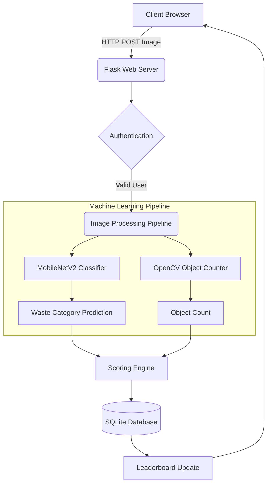
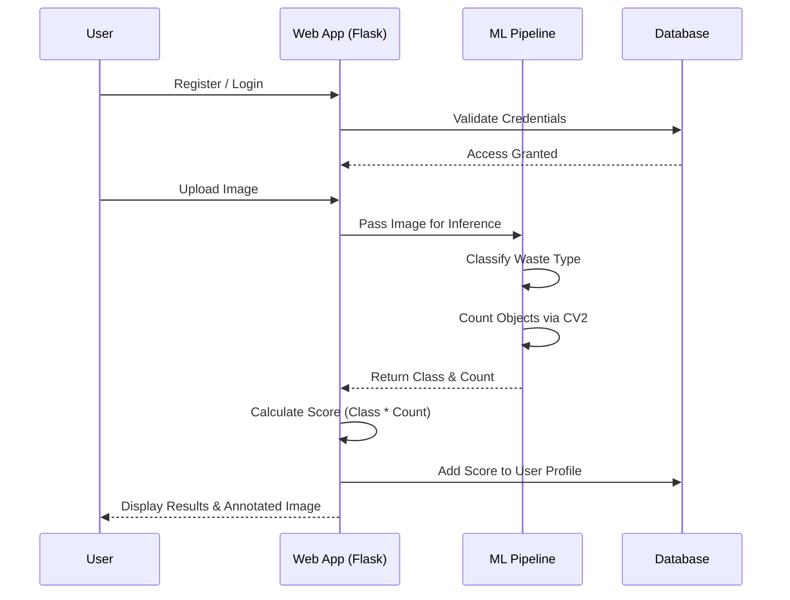

# Eco Resort => Waste Classification System

An intelligent web application that uses Machine Learning to classify waste images and an interactive scoring system to gamify environmental sustainability.

##  Overview

The application allows users to upload images of waste. The backend utilizes a deep learning model to predict the class of the waste (e.g., Biodegradable, E waste, Hazardous) and uses computer vision techniques to detect and count the number of objects. Based on the classification and count, users are awarded points, fostering an engaging leaderboard experience.

---

##  System Architecture

The project is built on a modular architecture separating the web server, database, and machine learning components.



---

##  User Flow Diagram



---

##  Scoring System Table

Each waste classification corresponds to a specific base score. The total score for an upload is calculated as `Base Score × Number of Objects Detected`.

| Waste Classification                     | Base Score per Item | Impact Level  |
| ---------------------------------------- | :-----------------: | ------------- |
| **Biodegradable**                        | 10                  | Low           |
| **Ewaste**                               | 20                  | Medium        |
| **Hazardous**                            | 30                  | High          |
| **Non Biodegradable**                    | 40                  | Very High     |
| **Pharmaceutical and Biomedical Waste**  | 50                  | Critical      |

---

##  Technology Stack

- **Backend:** Flask, Flask Login, Flask WTF
- **Machine Learning:** TensorFlow / Keras (MobileNetV2 base)
- **Computer Vision:** OpenCV
- **Database:** SQLAlchemy (SQLite)
- **Security:** Bcrypt (Password Hashing)

---

##  Setup & Installation

**1. Clone the repository and navigate to the project directory**
```bash
cd resort
```

**2. Create a virtual environment**
```bash
python -m venv venv
venv\Scripts\activate
```

**3. Install Dependencies**
```bash
pip install -r requirements.txt
```

**4. Run the Application**
```bash
python run.py
```

The server will start on `http://127.0.0.1:5000/`. You can navigate here in your browser, register an account, and start uploading images!